Lecture 28 - Interactive matplotlib plots 
------------------------------------------

Introduction
~~~~~~~~~~~~

At this point in the course,
you could think that Python is a programming language
which provide an good environment to develop
applications, and numerical algorithms,
but that is only the main idea of Python,
there are a lot of modules that you can use
in different areas, from programming GUIs to
interact with an Arduino through an USB or Bluetooth connection.

In this lecture, we will introduce a very useful
Python module, called `Matplotlib`_, as its name says,
is a *plotting library* for Python and NumPy.

.. image: http://matplotlib.sourceforge.net/_static/logo2.png

The *Application Programming Interface (API)* is based
on the object-oriented paradigm, providing functionality
to embedded plots in graphical applications,
or saving it in images.

You can use generic GUI toolkits,
like `Qt`_, `GTK`_ or `wxPython`_.

.. _`Qt`: http://qt.nokia.com/ 
.. _`GTK`: http://www.gtk.org/
.. _`wxPython`: http://www.wxpython.org/
.. _`Matplotlib`: http://matplotlib.sourceforge.net/

If you found examples which use a module called **pylab**
do not think that is an alternative, because is an interface
based on Matplotlib distributed under a BSD-style license,
and has the feature that combines **pyplot** and **NumPy**
modules in the same namespace.

The main advantage to Python programmers,
is that **Matplotlib** provide an environment very
similar to MATLAB, with some advantages,
like:

* Compatible with Python (and all the Python modules)
* An object-oriented environment to work.
* Open Source and Free
* etc

**Matplotlib** is focused in 2D plotting,
giving the tools to produce publication quality figures
in different formats, but also you can obtain 3D plots.

For example,

.. image:: http://matplotlib.sourceforge.net/_images/date_demo.png

.. image:: http://matplotlib.sourceforge.net/_images/subplot3d_demo.png

In **Matplotlib** you can generate with a few lines of code, plots,
histograms, power spectra, bar charts, errorcharts, scatterplots, etc.

You can find several useful examples in `this page`_.

.. _`this page`: http://matplotlib.sourceforge.net/gallery.html

Installation
~~~~~~~~~~~~

First of all, you need to search
with the package manager of your Linux distribution,
if *matplotlib* is in the repositories.

If not, you can check the `official installation guide`_,
and you can download the source from their `sourceforge`_
webpage.

.. _`official installation guide`: http://matplotlib.sourceforge.net/users/installing.html 
.. _`sourceforge`: http://sourceforge.net/projects/matplotlib/files/matplotlib/matplotlib-1.0.1/

Using ``pyplot``
~~~~~~~~~~~~~~~~

As we mentioned before, ``pyplot`` is a set of command functions which provides
an environment similar like MATLAB, Octave, etc.

To simplify the writing, the import will be:

::

    import matplotlib.pyplot as plt

So, we are importing the sub-module of ``matplotlib`` called ``pyplot``
with another name, in this case ``plt``, this mean that when we write
the following line:

::

    plt.some_function()

will be equivalent to:

::

    matplotlib.pyplot.some_function()

The first example will be the plotting of four values
in the commonly used ``y axis``, ``[1,2,3,4]``.

::

    import matplotlib.pyplot as plt
    plt.plot([1,2,3,4])
    plt.ylabel('some y values')
    plt.show()

The result of the code, will be:

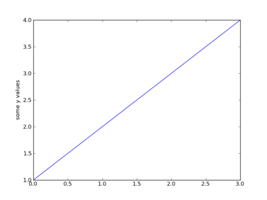

But, why we obtain a plot with only ``y axis`` values?
This is because when we give to the ``plot()`` function only **one list or array of values**,
matplotlib will assume that is a sequence of ``y values``, so the ``x axis`` values will generate
automatically.

You can also note the ``show()`` function, which allow to show the plot
with an external complement, which can be **Qt**, **GTK** or **wxPython**.

The ``plot()`` function is a very important one in matplotlib, and gives to the programmer
the possibility to take different number of argument.

So, considering the last two ideas, if we need to plot some ``x values`` versus ``y values``,
we can give another list or array to the function:

::
 
    import matplotlib.pyplot as plt

    plt.plot([1,2,3,4], [1,4,9,16])
    plt.ylabel('y values')
    plt.xlabel('x values')
    plt.show()

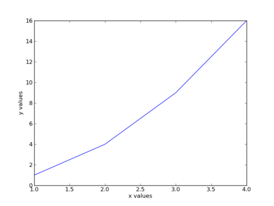

Note that we use two simple functions to set the labels of the ``x`` and ``y`` values,
called ``xlabel()`` and ``ylabel()`` respectfully.

Also, the ``plot()`` command will provide an optional third parameter,
which will determinate the color and line type of the plot.
The used letters and symbols are from MATLAB, and you can mix **colors**
with **line style** without problems.
The default format es ``'b-'`` which means, **Blue line**,
also you can obtain all the possible values if this parameter in the official
`plot() documentation`_.

.. _plot() documentation: http://matplotlib.sourceforge.net/api/axes_api.html#matplotlib.axes.Axes.plot

In the following example, we will use the points as **green circles**,
to the parameter is ``'go'``.

import matplotlib.pyplot as plt
plt.plot([1,2,3,4], [1,4,9,16], 'go')
plt.axis([0, 6, 0, 20])

Maybe you note, that we use another new function, called ``axis()``,
which will determinate the visible bounds of the ``x`` and ``y`` in a list
with the following way:

::

    axis([xmin, xmax, ymin, ymax])

As we mentioned before, the main idea an benefit of **matplotlib** is that we can use
an **array**, yes, the same arrays that we learn in the past lectures, a **numpy array**.

(All the sequences used in **matplotlib** are converted to numpy arrays internally, so we
always are using this data structures, event when we use lists).

An example, to clarify the behavior of **numpy** and **matplotlib** is described below:

::

    import numpy as np
    import matplotlib.pyplot as plt
    
    t = np.arange(0., 5., 0.2)
    plt.plot(t, t, 'r--', t, t**2, 'bs', t, t**3, 'g^')    
    plt.show()

* First, we import **numpy** and **matplotlib**,
* Second, we generate values from ``0.0`` to ``5.0`` using timesteps of ``0.2``,
* Third, we plot the data in three different ways:

 * Same data in ``x`` versus ``y``, using red dashes,
 * Same data in ``x`` versus ``y^{2}``, using blue squares,
 * Same data in ``x`` versus ``y^{3}``, using green triangles.

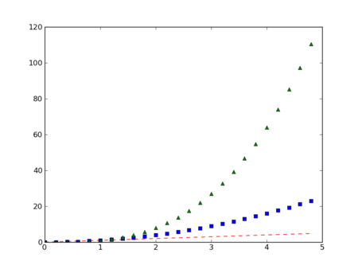

As you saw, the ``plot()`` now contains three trios of ``(x,y,style)`` values,
but that cannot be an unknown issue, because you learn in the past lectures
of to use the ``*args`` and ``**kwargs``, but this can also be used
writing three ``plot()`` calls:

::

    import numpy as np
    import matplotlib.pyplot as plt
    
    t = np.arange(0., 5., 0.2)
    
    plt.plot(t, t, 'r--')
    plt.plot(t, t**2, 'bs')
    plt.plot(t, t**3, 'g^')

    plt.show()

Another useful function is one called ``savefig()``
which provide the functionality to save an image
of our plot.
For example:

::

    import matplotlib.pyplot as plt

    x_values = [2, 3, 5, 7, 11]
    y_values = [4, 9, 5, 9, 1]
    plt.plot(x_values, y_values)
    plt.savefig("simple_plot.png")

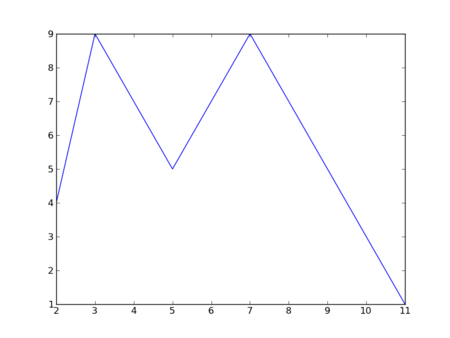

And works well, with any data type:

::

    import matplotlib.pyplot as plt
    import numpy as np

    x_values = [0.01*x for x in range(1000)]
    y_values = [np.sin(x) for x in x_values]
    plt.plot(x_values, y_values)
    plt.savefig("sin_plot.png")

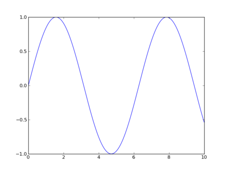

Plot types
~~~~~~~~~~

Histograms
===========

You can read the official documentation of `histograms`_,
to obtain more information about some details, parameters, etc.

The main idea is very simple,
and lets look the following example.

.. _histograms: http://matplotlib.sourceforge.net/api/axes_api.html?highlight=hist#matplotlib.axes.Axes.hist

::

    import numpy as np
    import matplotlib.mlab as mlab
    import matplotlib.pyplot as plt
    
    mu, sigma = 100, 15
    x = mu + sigma*np.random.randn(10000)
    
    # the histogram of the data
    n, bins, patches = plt.hist(x, 50, normed=1, facecolor='green', alpha=0.75)
    
    # add a 'best fit' line
    y = mlab.normpdf( bins, mu, sigma)
    l = plt.plot(bins, y, 'r--', linewidth=1)
    
    plt.xlabel('Smarts')
    plt.ylabel('Probability')
    plt.title(r'$\mathrm{Histogram\ of\ IQ:}\ \mu=100,\ \sigma=15$')
    plt.axis([40, 160, 0, 0.03])
    plt.grid(True)
    
    plt.show()

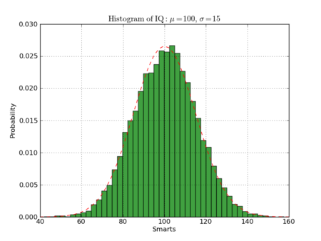

Paths
======

You can read the official documentation of `paths`_,
to obtain more information about some details, parameters, etc.

The main idea is very simple,
and lets look the following example.

.. _paths: http://matplotlib.sourceforge.net/api/path_api.html#matplotlib.path.Path

::

    import numpy as np
    import matplotlib.path as mpath
    import matplotlib.pyplot as plt
    
    Path = mpath.Path
    
    fig = plt.figure()
    
    pathdata = [
        (Path.MOVETO, (1.58, -2.57)),
        (Path.CURVE4, (0.35, -1.1)),
        (Path.CURVE4, (-1.75, 2.0)),
        (Path.CURVE4, (0.375, 2.0)),
        (Path.LINETO, (0.85, 1.15)),
        (Path.CURVE4, (2.2, 3.2)),
        (Path.CURVE4, (3, 0.05)),
        (Path.CURVE4, (2.0, -0.5)),
        (Path.CLOSEPOLY, (1.58, -2.57)),
        ]
    
    codes, verts = zip(*pathdata)
    path = mpath.Path(verts, codes)
    
    x, y = zip(*path.vertices)
    line, = plt.plot(x, y, 'go-')
    plt.grid()
    plt.title('spline paths')
    plt.show()

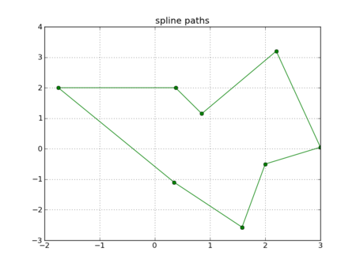

Pie charts
==========

You can read the official documentation of `pie charts`_,
to obtain more information about some details, parameters, etc.

The main idea is very simple,
and lets look the following example.

.. _pie charts: http://matplotlib.sourceforge.net/api/axes_api.html#matplotlib.axes.Axes.pie

::

    import matplotlib.pyplot as plt
    
    labels = 'Frogs', 'Hogs', 'Dogs', 'Logs'
    fracs = [15,30,45, 10]
    
    explode=(0, 0.05, 0, 0)
    plt.pie(fracs, explode=explode, labels=labels, autopct='%1.1f%%', shadow=True)
    plt.title('Raining Hogs and Dogs', bbox={'facecolor':'0.8', 'pad':5})
    
    plt.show()

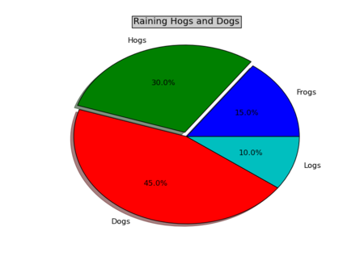

Bar charts
==========

You can read the official documentation of `bar charts`_,
to obtain more information about some details, parameters, etc.

The main idea is very simple,
and lets look the following example.

.. _bar charts: http://matplotlib.sourceforge.net/api/axes_api.html#matplotlib.axes.Axes.barh

::

    import matplotlib.pyplot as plt
    import numpy as np
    
    val = 3+10*np.random.rand(5)    # the bar lengths
    pos = np.arange(5)+.5    # the bar centers on the y axis
    
    plt.barh(pos,val, align='center')
    plt.yticks(pos, ('Tom', 'Dick', 'Harry', 'Slim', 'Jim'))
    plt.xlabel('Performance')
    plt.title('How fast do you want to go today?')
    plt.grid(True)
    
    plt.show()

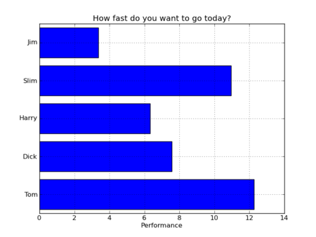

Etc
====

And so on!, you can review the `examples gallery`_ to see
more charts.

.. _examples gallery: http://matplotlib.sourceforge.net/gallery.html

Working with text
~~~~~~~~~~~~~~~~~~

There are two main functions, to add text to our plots,

which are the ``title()`` and the ``text()`` functions,

proving to set a  **plot title** and **write text** in any plot location,
respectevely.

You can read a more detail introduction to the **text in matplotlib**
in `this link`.

.. _this link: http://matplotlib.sourceforge.net/users/text_intro.html#text-intro

Lets consider the next example:

::
    
    import numpy as np
    import matplotlib.pyplot as plt
    
    mu, sigma = 100, 15
    x = mu + sigma * np.random.randn(10000)
    
    # the histogram of the data
    n, bins, patches = plt.hist(x, 50, normed=1, facecolor='g', alpha=0.75)
    
    plt.xlabel('Smarts')
    plt.ylabel('Probability')
    plt.title('Histogram of IQ')
    plt.text(60, .025, r'$\mu=100,\ \sigma=15$')
    plt.axis([40, 160, 0, 0.03])
    plt.grid(True)
    plt.show()

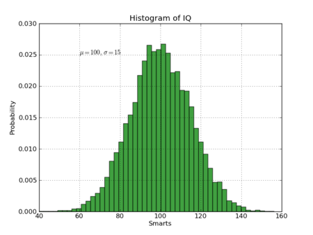
   
You can also modify any ``text()`` function,
because is an matplotlib.textText instance.
For example, customizing an **xlabel**, will be:

::

    t = plt.xlabel('my data', fontsize=14, color='red')

If you want to read a more deeply list of properties,
you can check the `Text properties and layout`_ page.

.. _Text properties and layout: http://matplotlib.sourceforge.net/users/text_props.html#text-properties

Using mathematical expressions in text
~~~~~~~~~~~~~~~~~~~~~~~~~~~~~~~~~~~~~~

If you are familiar with `TeX`,
you will be very happy to know, that
it is possible to write TeX code inside the plots,
like equations and special characters.

For example, you are able to write
a title using only TeX code:

::

    plt.title(r'$\sigma_i=15$')

The ``r`` preceeding the TeX code is a Python characteristic,
which means that the string inside the quotes
is a raw string, so when we use the backslash does not produce
an interpretation, for example:

::

    >>> print 'Hello\nBye'
    Hello
    Bye
    >>> print r'Hello\nBye'
    Hello\nBye
    >>>  

If you are interested in learn more about TeX code inside plots,
you can read the `Writing mathematical expressions`_ page.

.. _Writing mathematical expressions: http://matplotlib.sourceforge.net/users/mathtext.html#mathtext-tutorial

Annotating text
~~~~~~~~~~~~~~~

As we mentioned before, we can use the ``text()`` function to place
text in a any plot position, so in cases that we need to annotate some
idea in a plot section, we can use the ``annotate()`` function, which
provides an easiest way to make annotations.

In the ``annotate()`` function, there are two points to consider,
the location of the annotation (``xy``) and the text location (``xytext``).

For example:

::

    import numpy as np
    import matplotlib.pyplot as plt
    
    t = np.arange(0.0, 5.0, 0.01)
    s = np.cos(2*np.pi*t)
    line, = plt.plot(t, s, lw=2)
    
    plt.annotate('local max', xy=(2, 1), xytext=(3, 1.5),
                arrowprops=dict(facecolor='black', shrink=0.05),
                )
    
    plt.ylim(-2,2)
    plt.show()

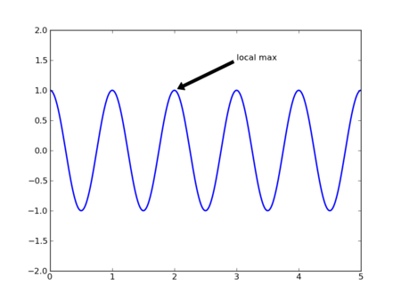

Exercises
~~~~~~~~~

* PENDING
