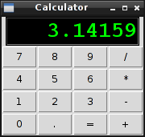

Assignment 8
============

Download and test `this program`_ which create a very simple
calculator:

.. _this program: ../../_static/programs/calculator.py

The only program section which are not implemented,
if the function of the :kbd:`=` button.

Their controller is the ``calculate`` function,
which you must implement,
to add the properly functionality.

Please note, that
there are some important issues,
that you can handle,
like the *zero division*.

**Optional items**

This items are not mandatory,
but could be a great opportunity,
to improve your knowledge in the graphical interfaces.

* Add a button Called :kbd:`C` to clean the calculator screen.
  (cleaning also the variables)

* Add new functionality buttons, like `square root`, `percentage`,
  `pow`, etc.

* Implement the calculator, but using **PySide**.
