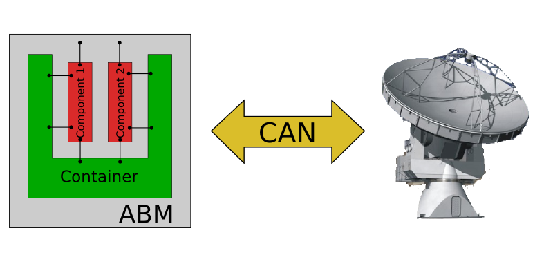
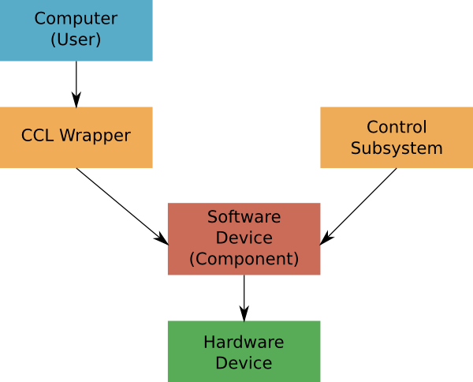

Lecture 30 - Control Command Language (CCL) Introduction
--------------------------------------------------------

ALMA Control Subsystem
=======================

The ALMA Control Subsystem is all the referring to the
software used to operate devices,
like frontend_ devices, backend_ devices,
and antennas.

You can download the `Control Subsystem Design`_ for a
more thorough reference.

The Control Subsystem is part of every regular ALMA
Software installation, on an STE.

.. _Control Subsystem Design: http://edm.alma.cl/forums/alma/dispatch.cgi/SubsystemDesign/showFile/100015/d20030221230518/Yes/Control+Design.pdf
.. _frontend: http://aivwiki.alma.cl/index.php/FronEnd_Devices
.. _backend: http://aivwiki.alma.cl/index.php/BackEnd_Devices

The Control subsystem is a part of the ALMA Common Software (ACS),
that uses a CORBA-based Control framework, so the idea is that
each hardware device control module has one ACS Component, running
inside the ABM of each antenna. Also, each ACS Component provides
an external communication interface.

The following diagram shows how **Components**,
**Containers**, **ABM**, and **Antenna** are related:

To understand the relationship between the aforementioned elements,
it is proper to say that:

* Containers contain a set of Components.
* Components usually wrap physical hardware devices.
* Components contain a set of Properties.
* Properties are specific control or monitor points of a component
* For standard hardware devices the control and monitor points are defined
  at the *Interface Control Documents (ICDs)*.

You can see this `ACS basic presentation`_,
if you want to clarify some doubts.

.. _ACS basic presentation: https://docs.google.com/viewer?a=v&pid=sites&srcid=ZGlzYy51Y24uY2x8YWNzd29ya3Nob3B8Z3g6NjI0YTc5ZDVjYTEwNTljYQ

Please note that not all the CCL classes,
are necessarily controlling devices through `Controller Area Network (CAN)`_ communication,
because there are some higher level components,
which are compatible, like ``FrontEnd`` controller,
``Antenna`` controller or ``Observing Modes``.

.. _Controller Area Network (CAN): http://en.wikipedia.org/wiki/Controller_area_network

Following the previous idea,
please note that not all CAN devices are inside the antennas.
For example, some of them are in
the ``CentralLO`` and ``Correlator``.

.. HW device control components are (mostly) code-generated, based on an XML spreadsheet, based on device ICD
.. XML spreadsheets are written in a way understandable for SW and HW engineers
.. Represents ICD – SW “mapping”
.. Allows to easily detect ICD v/s SW inconsistencies

The Control Command Language (CCL)
==================================

CCL is a language for accessing the Control software
using a very simple Python wrapper, so it is considered a high-level
scripting language.

Each device control component (written in C++)
has an associated Python wrapper, being a part of the CCL libraries.
Therefore, CCL commands directly execute one precise action of the
control component communication interface.

In simple words, a CCL class interacts directly with a Component
of a Container.

CCL has two main functions:

1. Serve as the language "observing scripts" are written in.
2. Serve as a suite of interactive commands to be used by hardware engineers,
   testing or debugging equipment, or staff astronomers, developing new observation
   procedures.

The next diagram explains the architecture
and the relationship between CCL and the control subsystem:

Most of the information regarding CCL is self-contained in the CCL wrapper,
based on the Python documentation utility **pydoc**.
To access the documentation, use the command ``help(<function>)`` where ``<function>``
can be any of the device types or functions listed at ``cclhelp()``.
You can also use the special IPython operator ``?`` to obtain help,
for example, by typing ``MountVertex.GET_ANTENNA_TEMPS?``.

It is not necessary to be a Python expert in order to use CCL.
The only two things that are very critical to be understood are
the **modules** and **object-oriented paradigm** topics,
which you learnt in previous lectures.

For example,
a little example using CCL could be::

    >>> from CCL.MountVertex import MountVertex
    >>> mount = MountVertex('DV01')
    >>> mount.GET_ANTENNA_TEMPS()

To enter the CCL environment, you can use ``startCCL`` command line.
This is the initialization script that provides the whole CCL environment.
Furthermore, you can import CCL classes from any Python script
that you write, or that you need to modify to perform some task.

When you execute ``startCCL``, you are starting an **ipython**
environment, along with some basic control **imports** and
some **special functions**.
If you understood the previous lectures content,
like classes, objects, methods and IPython,
working with CCL will be an easy task.

Please note that each time you obtain a device reference,
you are interacting with a real device,
so you generate CAN traffic.

The theoretical limit per channel per *Test Environment (TE)* is 90 messages,
where the first half of messages is used to send commands,
and the second half, to send monitor requests
(*Control Subsystem convention*).
In the worst case, the 90 messages can be reduced because some
non-responding device, because the CAN message timeout is about
2 ms.

Please be aware in order to avoid using CAN commands inside
loops that take many iterations.

.. For example, review the CCL wrapper for the DGCK device at CONTROL/Device/HardwareDevice/DGCK/src/CCL.
.. Note the that the base-class is code-generated and that the child-class contains the custom functionality.
.. There are also some documents available at EDM:

.. * Some Mount monitor points are requested every TE by an internal process and stored in a data structure
..     * statusData = mount.getMountStatusData()
..     * statusData.azPosition
.. * These values are used internally by the SW and aren't always available through an exposed monitor point
..     * AZ/EL current and commanded positions
..     * (Aux) Pointing model corrections
..     * AZ/EL encoder readouts
..     * Subreflector current and commanded positions

Commissioning
=============

Instantiating Objects/Devices
~~~~~~~~~~~~~~~~~~~~~~~~~~~~~

Its applies only to classes/device types,
and it is possible to work with multiple instances,
for example, the same device on two different antennas,
because each device will provide a different class constructor.

Once the object is created,
you can use it to access all the properties and values of the hardware device.

For example,
we can obtain an digital clock object::

    In [1]: dgck = DGCK(“DV01”)

Now with the ``dgck`` object,
you can call its methods.

The methods correspond mostly to monitor and control
point, normally using only uppercase attributes,
like ``MountVertex.GET_ANTENNA_TEMPS``,
if we are using a device controller instance.
Also, you can use higher-level methods,
like ``FrontEnd.powerUpBand``.

STATUS() Command
~~~~~~~~~~~~~~~~

The ``STATUS()`` method provides a summary of the device
status, showing device information like **type**, **name** and
the **status** monitor point.

You can use this command for each device,
and you can call it from the Python interface
as ``<device>.STATUS()``.

.. Device Grouping
.. ~~~~~~~~~~~~~~~
.. 
.. CCL allows the instantiation of several devices of the same type,
.. at the same time, using as reference a list of the devices.
.. 
.. For example, if you want to obtain a object group of digital clock from
.. two different antennas, like **DV01** and **DA41**, the code will be::
.. 
..     In [1]: dgGroup = DGCK([“DV01”, “DA41”])
.. 
.. Any single device functionality will be available for a group.
.. 
.. If you want to get the values from a group,
.. they are returned as a dictionary
.. whose keys are device names::
.. 
..     In [8]: dg.GET_PS_VOLTAGE_CLOCK()
..     Out[8]:
..     {'DA41': (6.4907135963439941, 134258794536106775L),
..     'DV01': (6.0117301940917969, 134258794540835083L)}

CCL Language Description
=========================

The following content was extracted from the `CCL User Manual Version C`_.

.. _`CCL User Manual Version C`: http://wikis.alma.cl/twiki/pub/AIV/AIV_COMP/COMP-70.35.60.00-001-C-MAN.pdf

Observing Modes
~~~~~~~~~~~~~~~

The observing modes are the highest level of synchronization in the CCL.
These modules provide functionality for managing all the equipment in an array.

For instance, tuning the LO system to a specified frequency or having all antennas in the array point in the same direction.

The observing modes can be coupled to data capture
and the production of astronomical data in the ALMA Science Data Model (ASDM) format.

For most scientific users,
there should be no reason to work below the level of an observing mode.

The observing modes are tied to specific ALMA use cases.
For instance, Single-Field Interferometry,
Optical Pointing,
and Tower Holography all have observing modes tailored to their specific requirements.

The name of these objects as observing modes can cause some confusion.
An observing mode in the CCL is a class that has been designed to simplify and coordinate a type of observing.

The standard observing modes which you encounter in the ALMA ObservingTool,
and later in this document are scripts written in the CCL to implement a particular observing strategy.

Thus the standard observing mode scripts make use of the observing mode CCL objects to implement a particular observing strategy.

As an example the standard observing mode script to perform a calibrator survey is very different from the script to do an observation of a single source,
but both scripts would make use of the functionality provided by the single-field interferometry observing mode class in the CCL.

Mode Controllers
~~~~~~~~~~~~~~~~~

Mode controllers play the same role for an antenna that the observing modes do for an Array.
These objects still have a concept of scientific intent for instance knowing that setting frequency
when using the holography receiver and setting frequency when using the front-end are very different actions.

Users should be aware that there is no effort to synchronize changes made at the mode controller level,
with status at the observing mode level.
As an example consider the following case:
the user sets the frequency of an entire array using the ``setFrequency`` command of the observing mode.

Then the user sets the frequency of antenna **DA41** using the mode controller ``setFrequency`` command.

Only the hardware in the antenna **DA41** will be affected,
so the array will be in an inconsistent state and,
depending on the settings of the central photonic reference,
the LO chain in **DA41** may not even lock.

This level of flexibility is required to allow system testing but should only be utilized by users
who are aware of the full system implications.

Devices
~~~~~~~~

Devices form the lowest layer in our hierarchy.
These classes are mapped one-to-one to the physical hardware,
and provide both integrated methods
(i.e. a single method to tune and lock the second local oscillator module)
and simple peek/poke level access,
allowing direct manipulation of most monitor and control points.

Utility Classes
~~~~~~~~~~~~~~~~
There are a set of utility classes also contained within the CCL, these classes provide a wide range of services.
For example the ``SkyDelayServer`` module allows communication and control of the delay server,
while the classes in the CCL.
Source package provide flexible ways to specify an astronomical source.

Extra lecture material
======================

The following links and documents are extracted from ALMA wikis:

* `ALMA Control Command Language Brief Introduction`_
* `CCL official site`_
* `CCL Commissioning Procedure`_
* `CCL Device Software`_

.. _ALMA Control Command Language Brief Introduction: http://almasw.hq.eso.org/almasw/pub/CONTROL/ControlCommandLanguage/ALMAControlCommandLanguage.pdf
.. _CCL official site: http://ccl.aiv.alma.cl/
.. _CCL Commissioning Procedure: http://wikis.alma.cl/bin/view/AIV/CCLCommissioningProcedure
.. _CCL Device Software: http://aivwiki.alma.cl/index.php/CCL_Device_Software

FAQ CCL
==========

This is a FAQ obtained from the `ALMA wiki`_.

.. _`ALMA wiki`: http://aivwiki.alma.cl/index.php/CCL_FAQ

How do I run CCL on my computer?
~~~~~~~~~~~~~~~~~~~~~~~~~~~~~~~~~

The idea of CCL, is interact with the devices,
connected to a corresponding control units (ABM),
remotely, i.e. using a SSH-client to connect
to the machine.

How do I monitor and control a device?
~~~~~~~~~~~~~~~~~~~~~~~~~~~~~~~~~~~~~~~

First of all you need to create an "instance" belonging to the physical device
you want to monitor or control.
For this review the list of device types you obtain when issuing `cclhelp()`.
Once you know the device type you create your instance by indicating its location
(e.g. antenna name), its absolute component name,
and eventually some additional parameters (e.g. polarization), for example::

    >>> lpr = LPR("DA41")
    >>> ifp0 = IFProc("DA41", 0)
    >>> lo20 = LO2(componentName="CONTROL/DA41/LO2BBpr0")

Use ``help(<device type>)``, e.g. ``help(LO2)``, for a detailed description and an
example of usage if you encounter problems.
Note that "lorr", "ifp0" and "lo20" are variables that you can define as you want,
for example, you could have used "x", "y" and "z" instead.
However, a good convention is to use the device's name in lowercase.
You can now use your variable to access both monitor- and control points, for example::

    >>> lpr.GET_TEMP0_TEMP()
    (2.9744236469268799, 134315513756484480L)
    >>> lpr.SET_OPT_SWITCH_PORT(8)

As you can see, the methods that retrieve the monitor points all start with
``GET_``, and the ones for control points with ``SET_``. Use tab-completion and
``help(<function>)`` for further details::

    >>> help(lo20.SET_PHASE_VALS)

Last but not least,
you can also display the the status information
using the helper function ``status``, for example::

    >>> status(lpr)

**Note:** If you want to try some CCL command in real machines,
please make contact with people working in STE at OSF.

Exercises
~~~~~~~~~~

Some of the following exercises are extracted from the `CCL Training presentation`_ (by Bernhard Lopez and Ruben Soto).

.. _`CCL Training presentation`: http://aivwiki.alma.cl/~acaceres/CCLTraining_v2.pdf

Remember that you can access to the documentation of each `Observing Mode`, `Mode Controllers`, `Devices`, etc
in the `official documentation page`_.

.. _`official documentation page`: http://ccl.aiv.alma.cl/CCLReferenceManual.711/

* Exercise 1

    * Start CCL
    * Display the available device types, functions and variables
    * Display the help-text for the classes *WVR* and for the *DGCK*.
    * Display the help-text for the functions ``pingabm()`` and ``get_devices()``.

*  Exercise 2

    * Instantiate the following objects (check the help-text for ``__init__`` to obtain the constructors parameters):

        * *DGCK* on container ``DV01`` (if available)
        * *WVR* on container ``DV01`` (if available)

*  Exercise 3

    * Access the device functionality (use tab-completion to see the available methods):

        * Read the value of ``PS_VOLTAGE_CLOCK`` of the *DGCK*.
        * Get the alarms associated to the *WVR* instance. (use the *GET_WVR_ALARMS()* method).

*  Exercise 4

    * Execute the STATUS method for *DGCK* on container ``DV01``.
    * Execute the STATUS method for *FLOOG* on container ``DA41``.

*  Exercise 5

    * Instantiate a group of DGCKs devices for *DV01* and *DA41* containers.
    * Execute ``STATUS()`` method for the group.
    * Use ``DelayTrackingEnabled()`` method for the DGCK group.
    * Set DelayTracking to False over the DGCK group.
