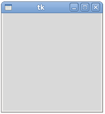
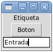
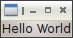
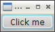
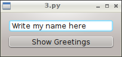

Lecture 31 - Graphical Interfaces
---------------------------------

Every program needs to have some mechanism
to receive an input and return an output.
We have already seen two ways of input:

* keyboard input (``raw_input``), and
* input file (``for line in file: ...``);

and two output ways:

* console output (``print``), and
* output file (``file.write (...)``).

.. index:: graphical interface

Most programs that deal every day do not work in this way,
but have a **graphical interface**,
made up of windows, menus, buttons and other elements,
through which we interact with the program.

Programs with **Graphical User Interface (GUI)**
are fundamentally different from programs
with text interfaces.
The programs we have written so far
run entirely from beginning to end,
stopping only when we input data.

Graphical programs, moreover,
only perform actions when
certain events are triggered by the user
(like clicking on a button or writing something in a text box),
and the rest of the time they wait for something to happen,
without doing nothing.
The program has no control over when to do something.
This requires that programs are structured
in a special way, which we will learn little by little.

Tkinter
~~~~~~~

.. index:: Tkinter

Python includes a module called ``Tkinter``
which provides all the necessary functions,
to be imported at the beginning of the program::

    from Tkinter import *

Windows creation
'''''''''''''''''

The following program
is a simple graphical interface which can be created::

    from Tkinter import *
    w = Tk()
    w.mainloop()

Try it:
Copy the program in a text editor,
save it and run it.
You should see an empty window:

The ``w = Tk()`` statement
creates the main window,
and assigns it, to the ``w`` variable.
All GUI should have a main window
in which things will be added.
This line goes at the beginning of the program always.

The ``w.mainloop()`` statement
indicates to the interface that should just wait
for the user to do something.
This line must always be at the end of the program.

.. index:: event loop

When executed,
may find out that the program does not end.
This is because the ``mainloop()`` method call
is «stuck» waiting for something to happen.
This is called an **event loop**,
and is simply an infinite loop which is constantly waiting
for something to happen.

All GUI programs
must follow this structure:
the creation of the window early in the program
and calling the event loop at the end of the program.

Widget creation
''''''''''''''''

.. index:: widget

A **widget** is anything that you can put in a window.
For now, we see three types of simple widgets,
which are sufficient to create a functional GUI:

* **labels** (``Label``)
  are used to display data,
* **buttons** (``Button``)
  are used to make something happen in the program, and
* **input fields** (``Entry``)
  are used to enter data into the program.

In a running program,
these widgets look like this:

The ``Entry`` is analogous to the ``raw_input``
of the console programs:
used to receive a program input.
The ``Label`` is similar to ``print``:
used to return the output.

A button can be seen as a «function caller»:
whenever a button is pressed,
a call to the associated button will be made.
The buttons does not have an analogous,
because console programs run from beginning to end immediately,
and therefore do not need that a function caller
triggered by the user.

To add a widget to a program,
you have to use the function with the widget names
(``Label``, ``Button`` and ``Entry}``).
These functions receive as first mandatory parameter
the containing window of the widget.
They also have optional parameters,
which needs to be passed using the name parameter
assignation syntax.
For example,
the ``text`` parameter is used to indicate
the text which appears on a button or a label.

For example,
the following statement
creates a button with the text ``Greet``,
contained in the ``w`` window::

    b = Button(w, text='Greet')

While this creates the button
and assign it to a ``b`` variable,
the button is not added into the ``w`` window immediately:
what we did was just tell the button their container,
to take it into account when being added.
For this to happen,
we needs to call the ``pack`` method,
which is a way to tell the widget
«self-pack inside your container»::

    b.pack()

As reference,
the program which creates the image window
is the following (try it!)::

    from Tkinter import *
    
    w = Tk()
    
    l = Label(w, text='Label')
    l.pack()
    
    b = Button(w, text='Button')
    b.pack()
    
    e = Entry(w)
    e.pack()
    
    w.mainloop()

The widgets are being stacked vertically,
from top to bottom,
in the same order they are being stacked.

PySide - Qt bindings
~~~~~~~~~~~~~~~~~~~~~

.. index:: pyside qt

The `PySide project`_ provides Python bindings
to use the Qt framework.

`Qt`_ is a cross-platform application and user interface framework,
used widely in several technological projects,
like `devices`_ such as, tablets, netbooks, projectors, smartphones, etc.
Also is present in `desktop` application such as,
`VLC`_, `KDE`_, `Google Earth`_, `Skype`_, `Avogadro`_, etc.
Finally, Qt is present is a lot of another projects,
like the `MeeGo OS`_, `Mathematica`_ (Wolfram Research), `Lucas Film Ltd.`_,
`Walt Disney Animation Studios`_, etc.

.. _Qt: http://qt.nokia.com
.. _devices: http://qt.nokia.com/qt-in-use/story/device
.. _desktop: http://qt.nokia.com/qt-in-use/target/desktop
.. _VLC: http://qt.nokia.com/qt-in-use/story/app/vlc-player/
.. _KDE: http://www.kde.org/
.. _Google Earth: http://www.google.com/earth
.. _Skype: http://www.skype.com/
.. _Avogadro: http://avogadro.openmolecules.net/wiki/Main_Page
.. _MeeGo OS: https://meego.com/
.. _Mathematica: http://qt.nokia.com/qt-in-use/story/customer/mathematica-by-wolfram-research
.. _Lucas Film Ltd.: http://qt.nokia.com/qt-in-use/story/app/lucasfilm-entertainment-company-ltd
.. _Walt Disney Animation Studios: http://qt.nokia.com/qt-in-use/story/customer/walt-disney-feature-animation
.. _PySide project: http://pyside.org

Any application developed using PySide allow free open source
and proprietary licences.

Installation
'''''''''''''

To install **Qt** and **PySide**,
you need to check first if your software manager
(Linux / Mac OS X) provides a version,
if not,
you can download and following the installation
instruction on the `Qt download page`_
and `PySide download page`_.

Remember which both,
are compatible with **Windows**, **Linux** and **Mac OS X**.

.. _Qt download page: http://qt.nokia.com/downloads
.. _PySide download page: http://developer.qt.nokia.com/wiki/Category:LanguageBindings::PySide::Downloads

Examples
'''''''''

The best way to understand to develop graphical applications,
is through simple examples.

Hello World
************

First of all,
you need to know what modules to import,
so, because we are learning,
we will import all the main classes.

To handle the application exit,
is necessary to import the ``sys`` module::

    import sys

To work with some Qt basics,
we will import all the subclasses of ``QtCore`` and ``QtGui``
modules::

    from PySide.QtCore import *
    from PySide.QtGui import *

Now, we need to create a *Qt application*::

    app = QApplication(sys.argv)

The window will contain only
a label which says ``Hello World``,
so we will create the *label*
and show it::

    label = QLabel("Hello World")
    label.show()

So, now we need to enter in the Qt application main
loop, which maintain the application running::

    app.exec_()
    sys.exit()

The entire code,
will look something like this::

    import sys
    from PySide.QtCore import *
    from PySide.QtGui import *
     
    app = QApplication(sys.argv)

    label = QLabel("Hello World")
    label.show()

    app.exec_()
    sys.exit()

And the result will be:

Clickable Button
******************

Example extracted from the official `clickable button`_ example.

.. _clickable button: http://developer.qt.nokia.com/wiki/PySideTutorials_Clickable_button

We will do the same previous import::

    import sys
    from PySide.QtCore import *
    from PySide.QtGui import *

Now, we will create a simple function which print a *Hello World!* message::

    def sayHello():
        print "Hello World!"

We need to create also a Qt application::

    app = QApplication(sys.argv)

Now, we will create a clickable button, which is called ``QPushButton``,
and inside the class constructor, we will give a Python string to set the button label::

    button = QPushButton("Click me")

But, how we can connect an action to the button click event?
This is one of the most important concepts behind the
graphical user interface development.

We will connect the click event,
to the function called ``sayHello()``

Each Qt object provides some signals,
associated to every event,
in this case the ``QPushButton`` signal is ``clicked``,
so we will connect the signal to the function::

    button.clicked.connect(sayHello)

Finally, we will just show the button and start the Qt main loop::

    button.show()    
    app.exec_()

Everytime that the user click the button,
a message in the console will appear,
saying `Hello World!`.

The entire code looks like this::

    #!/usr/bin/python

    import sys
    from PySide.QtCore import *
    from PySide.QtGui import *
     
    def sayHello():
        print "Hello World!"
     
    app = QApplication(sys.argv)

    button = QPushButton("Click me")
    button.clicked.connect(sayHello)
    button.show()

    app.exec_()  

Simple Dialog
**************

Example extracted from the official `simple dialog`_ tutorial.

.. _simple dialog: http://developer.qt.nokia.com/wiki/PySideTutorials_Simple_Dialog

As you can see in the previous examples,
we write all the code in the body of the script,
without an order, but, it is possible,
and is the best way to develop application,
using **classes**.

So, we will start the development of this example
with a base code::

    #!/usr/bin/python
     
    import sys
    from PySide.QtCore import *
    from PySide.QtGui import *
     
    class Form(QDialog):
         
        def __init__(self, parent=None):
            super(Form, self).__init__(parent)
            self.setWindowTitle("My Form")
     
     
    if __name__ == '__main__':
        # Create the Qt Application
        app = QApplication(sys.argv)
        # Create and show the form
        form = Form()
        form.show()
        # Run the main Qt loop
        sys.exit(app.exec_())

The only code line that maybe
you do not understand,
is::

    super(Form, self).__init__(parent)

The reason of this line,
is because we are using *inheritance*
from a `QDialog` widget, so in this way,
we are calling the *QDialog constructor*.

The last code line::

    sys.exit(app.exec_())

means, that when the application loop ``app.exec_()``
ends, the script will be terminated ``sys.exit()``.

First,
we will create the necessary widgets,
a ``QLineEdit`` to enter our name,
and a ``QPushButton`` to print
a message with the value of the ``QLineEdit``.
All this will be inside the class constructor (``__init__()``)::

    self.edit = QLineEdit("Write my name here..")
    self.button = QPushButton("Show Greetings")

Is not necessary to call the ``show()`` method for each
object, because when we show the class,
all the element will display on the main window.

So now, we have two elements inside our windows,
but in which order and position?
Simple!, lets create a layout to add
all the inner elements of the interface.
We will create a simple vertical box layout
called ``QVBoxLayout`` which will distribute
the inside widgets vertically, just adding
this lines in the class constructor (``__init__()``)::

    layout = QVBoxLayout() # creating layout
    layout.addWidget(self.edit) # adding the line edit
    layout.addWidget(self.button) # adding the button
    self.setLayout(layout) # setting the layout to our main window

As the previous example,
we will create a function to greet and connect the button event.
This will be a class method::

    def greetings(self):
        print 'Hello', self.edit.text()

We have access to the text by means of the ``QLineEdit.text()`` method.

Finally,
we just need to connect the button
to the ``greetings()`` method,
in the class constructor (``__init__()``)::

    self.button.clicked.connect(self.greetings)

The entire example
looks like::

    import sys
    from PySide.QtCore import *
    from PySide.QtGui import *
     
    class Form(QDialog):
         
        def __init__(self, parent=None):
            super(Form, self).__init__(parent)

            self.edit = QLineEdit("Write my name here")
            self.button = QPushButton("Show Greetings")        

            layout = QVBoxLayout()
            layout.addWidget(self.edit)
            layout.addWidget(self.button)

            self.setLayout(layout)

            self.button.clicked.connect(self.greetings)
             
        def greetings(self):
            print ("Hello %s" % self.edit.text())        
     
     
    if __name__ == '__main__':

        app = QApplication(sys.argv)

        form = Form()
        form.show()

        sys.exit(app.exec_())

Once executed,
you can insert your name in the ``QLineEdit`` and watch the console for greetings.

You can found all the documentation in their `official wiki`_,
and a lot of examples in their `Git repository`.

.. _official wiki: http://developer.qt.nokia.com/wiki/PySideDocumentation/
.. _Git repository: http://qt.gitorious.org/pyside/pyside-examples

PyQt - Qt bindings
~~~~~~~~~~~~~~~~~~~

`PyQt`_ is a set of Python bindings for Nokia's Qt application framework,
and runs on all platforms supported by Qt including Windows, MacOS/X and Linux.

Unlike Qt, PyQt v4 is not available under free open source licence,
so it is necessary to purchase the commercial version of PyQt.

Because PyQt was the first Qt bindings for Python,
you will find a lot of examples which use PyQt
instead PySide, but do not worry, there are compatible
using a little *alias* at the time to write
the imports.

You need to change something like this::

    import PyQt

to this::

    import PySide as PyQt

and the program will work properly.

.. _PyQt: http://www.riverbankcomputing.co.uk/software/pyqt/intro
