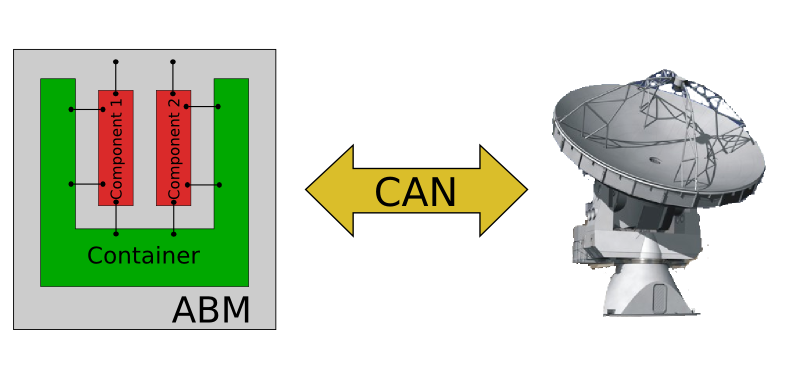

Lecture 30 - CCL Introduction
-----------------------------

ALMA Control Subsystem
=======================

The ALMA Control Sybsystem is all the refering to the
software used to operate devices, like `frontend`_ and `backend`_ devices,
and the Antennas.

You can download the `Control Subsystem Design`_ to obtain a
deeply reference.

Remember that you can retrieve the source code
in the official ALMA CVS, in the package **CONTROL**,
and if you want to compile and install it on your computer,
you need to retrieve the packages **ICD** and **OFFLINE**,
then bluid in the order **ICD**, **OFFLINE** and **CONTROL**.

.. _`Control Subsystem Design`: http://edm.alma.cl/forums/alma/dispatch.cgi/SubsystemDesign/showFile/100015/d20030221230518/Yes/Control+Design.pdf
.. _`frontend`: http://aivwiki.alma.cl/index.php/FronEnd_Devices
.. _`backend`: http://aivwiki.alma.cl/index.php/BackEnd_Devices

The Control subsystem is a part of the ALMA Common Software (ACS),
which use a CORBA-based Control framework, so the idea is that
each hardware device control module, has one ACS Component, runing
inside the ABM of each antenna, also, each ACS Component provides
an external communication interface.

The Following diagram show the relation between **Components**,
**Containers**, **ABM**, and **Antenna**.

To understand the realation between the previous elements,
it is properly to say that:

 * Containers contain a set of Components.
 * Components usually wrap physical hardware devices.
 * Components contain a set of Properties.
 * Properties are specific control or monitor points of a component
 * For standard hardware devices the control and monitor points are defined at the ICDs.

.. HW device control components are (mostly) code-generated, based on an XML spreadsheet, based on device ICD
.. XML spreadsheets are written in a way understandable for SW and HW engineers
.. Represents ICD – SW “mapping”
.. Allows to easily detect ICD v/s SW inconsistencies

The Control Command Language (CCL)
==================================

CCL is a language which allows you to access the Control software
using a very simple Python wrapper, so it is considered a high-level
scripting language.

Each device control component (written in C++)
has an associated Python wrapper, being a part of the CCL libraries.
Therefore, CCL commands directly call an certain action of the
control component communication interface.

In simple words, a CCL class interact directly with a Component
of a Container.

CCL has two main functions:

 1. Serve as the language in which are written the "observing scripts".
 2. Serve as a suite of interactive commands to be used by harware engineers,
    testing or debugging equipment, or staff astronomers, developong new observing
    procedures.

The next diagram explain the architecture,
and the relation between CCL and the control subsystem:

.. image:: ../../_static/images/ccl_02.png
   :alt: CCL Architecture 
   :width: 500px

Most of the information regarding CCL is self-contained in the CCL wrapper,
based on the Python documentation utility **pydoc**.
To access the documentation use the command ``help(<function>)`` where ``<function>``
can be any of the device types or functions listed at ``cclhelp()``.

Is not necessary to be a Python expert to use CCL,
the only two thinks which are very critical
is to understand the **modules** and **object-oriented paradigm** topics,
which you saw in the previous lectures.

For example,
a little example using CCL could be:

::

    >>> from CCL.MountVertex import MountVertex
    >>> mount = MountVertex('DV01')
    >>> mount.GET_ANTENNA_TEMPS()

To start CCL, you need to write ``startCCL`` on the command line,
which is the init script that provides the whole CCL environment.

When you execute ``startCCL`` you are calling an **ipython**
environment, plus some basic control **imports** and
some **special functions**, so that is the reason
to understand the content of the previous lectures,
know how ipython works.

.. For example, review the CCL wrapper for the DGCK device at CONTROL/Device/HardwareDevice/DGCK/src/CCL.
.. Note the that the base-class is code-generated and that the child-class contains the custom functionality.
.. There are also some documents available at EDM:

.. * Some Mount monitor points are requested every TE by an internal process and stored in a data structure
..     * statusData = mount.getMountStatusData()
..     * statusData.azPosition
.. * These values are used internally by the SW and aren't always available through an exposed monitor point
..     * AZ/EL current and commanded positions
..     * (Aux) Pointing model corrections
..     * AZ/EL encoder readouts
..     * Subreflector current and commanded positions

Commisioning
=============

Instantiating Objects/Devices
~~~~~~~~~~~~~~~~~~~~~~~~~~~~~

Its applies only to classes/device types, be able to work with
multiple instances, for example, the same device on two different antennas,
because each device has a different constructor.

Once the object is created, you can use it to access
to all the properties and values from the hardware device.

For example,
we can obtain an digital clock object
or a reference to the sampling tool:

::

    In [1]: dgck = DGCK(“DV01”)
    In [2]: st = SampTool()

MonitorTool & monitor
~~~~~~~~~~~~~~~~~~~~~

The MonitorTool allows the user to display the values of the properties,
in real-time, on the screen. Also, is based on the ACS Monitor implemenation.

The refresh rate of the properties values is defined on the Configuration Data Base (CDB),
in a variable called ``default_trigger_time``, and can be turned if incorrect.

You can use a wrapper function called ``monitor()`` to simplify the syntax.

SampTool & sample
~~~~~~~~~~~~~~~~~

The SampTool allows to sample different properties
at high different frequency, over 20Hz, and store all the data
in ``CSV`` files.

The SampTool is based on the ACS Sampling System,
and is written in Java.

Please note, that SampTool not allow precise TE sampling,
and you can also use this tool, through a wrapper
function called ``sample()`` which provides a simplified syntax.

STATUS() Command
~~~~~~~~~~~~~~~~

The ``STATUS()`` method provides a summary of the device
status, showing device information like the **type**, **name** and
the **status** monitor point displayed properly.

You can use this command for each device,
and you can call it from the Python interface
as ``<device>.STATUS()``.

Device Grouping
~~~~~~~~~~~~~~~

CCL allows the instantiation of several devices of the same type,
at the same time, usign as reference a list of the devices.

For example, if you want to obtain a object group of digital clock from
two different antennas, like **DV01** and **DA41**, the code will be:

::

    In [1]: dgGroup = DGCK([“DV01”, “DA41”])

Any single device functionallity will be available for a group.

If you want to get the values from a group,
they are returned using a dictionary,
with the device name as key.

::

    In [8]: dg.GET_PS_VOLTAGE_CLOCK()
    Out[8]:
    {'DA41': (6.4907135963439941, 134258794536106775L),
    'DV01': (6.0117301940917969, 134258794540835083L)}

CCL Language Description
=========================

The following content was extracted from the `CCL User Manual Version C`_.

.. _`CCL User Manual Version C`: http://wikis.alma.cl/twiki/pub/AIV/AIV_COMP/COMP-70.35.60.00-001-C-MAN.pdf

Observing Modes
~~~~~~~~~~~~~~~

The observing modes are the highest level of synchronization in the CCL,
these modules provide functionality for managing all the equipment in an array.

For instance tuning the LO system to a specified frequency or having all antennas in the array point in the same direction.

The observing modes can be coupled to data capture and the production of astronomical data in the ALMA Science Data Model (ASDM) format.

For most scientific users,
there should not be a reason to work below the level of an observing mode.

The observing modes are tied to specific ALMA use cases,
for instance Single-Field Interferometry,
Optical Pointing,
and Tower Holography all have observing modes tailored to their specific requirements.

The name of these objects as observing modes can cause some confusion.
An observing mode in the CCL is a class which is designed to simplify and coordinate a type of observing.

The standard observing modes which you encounter in the ALMA ObservingTool,
and later in this document are scripts written in the CCL to implement a particular observing strategy.

Thus the standard observing mode scripts make use of the observing mode CCL objects to implement a particular observing strategy.

As an example the standard observing mode script to perform a calibrator survey is very different from the script to do an observation of a single source,
but both scripts would make use of the functionality provided by the single-field interferometry observing mode class in the CCL.

Mode Controllers
~~~~~~~~~~~~~~~~~

Mode controllers play the same role for an antenna that the observing modes do for an Array.
These objects still have a concept of scientific intent for instance knowing that setting frequency
when using the holography receiver and setting frequency when using the front-end are very different actions.

Users should be aware that there is no effort to synchronize changes made at the mode controller level,
with status at the observing mode level.
As an example consider the following case,
the user sets the frequency of an entire array using the ``setFrequency`` command of the observing mode.

Then the user sets the frequency of antenna **DA41** using the mode controller ``setFrequency`` command.

Only the hardware in the antenna **DA41** will be affected,
so the array will be in an inconsistent state and,
depending on the settings of the central photonic reference,
the LO chain in **DA41** may not even lock.

This level of flexibility is required to allow system testing but should only be utilized by users
who are aware of the full system implications.

Devices
~~~~~~~~

Devices form the lowest layer in our hierarchy.
These classes map one-to-one with the physical hardware and provide both integrated methods
(i.e. a single method to tune and lock the second local oscillator module)
and simple peek/poke level access,
allowing direct manipulation of most monitor and control points.

Utility Classes
~~~~~~~~~~~~~~~~

There are a set of utility classes also contained within the CCL, these classes provide a wide range of services.
For example the ``SkyDelayServer`` module allows communication and control of the delay server,
while the classes in the CCL.
Source package provide flexible ways to specify an astronomical source.

Extra lecture material
======================

The following links and documents are extracted from ALMA wikis:

* `ALMA Control Command Language Brief Introduction`_
* `CCL official site`_
* `CCL Commisioning Procedure`_
* `CCL Device Software`_

.. _`ALMA Control Command Language Brief Introduction`: http://almasw.hq.eso.org/almasw/pub/CONTROL/ControlCommandLanguage/ALMAControlCommandLanguage.pdf
.. _`CCL official site`: http://ccl.aiv.alma.cl/
.. _`CCL Commisioning Procedure`: http://wikis.alma.cl/bin/view/AIV/CCLCommissioningProcedure
.. _`CCL Device Software`: http://aivwiki.alma.cl/index.php/CCL_Device_Software

FAQ CCL
==========

This is a FAQ obtainer from the ALMA wiki.

How do I run CCL on my computer?
~~~~~~~~~~~~~~~~~~~~~~~~~~~~~~~~~

In reality, you do not run CCL on "your" computer, but on a remote one which is
connected to the corresponding control units (ABMs).
This means that from your computer you first have to log into this computer,
e.g. using a SSH-client (see explanation above). The CCL Python wrapper is then
started by issuing "startCCL" at the command prompt.

How do I monitor and control a device?
~~~~~~~~~~~~~~~~~~~~~~~~~~~~~~~~~~~~~~~

First of all you need to create an "instance" belonging to the physical device
you want to monitor or control.
For this review the list of device types you obtain when issuing `cclhelp()`.
Once you know the device type you create your instance by indicating its location
(e.g. antenna name), its absolut component name,
and eventually some additional parameters (e.g. polarization), for example:

::

    >>> lpr = LPR("DA41")
    >>> ifp0 = IFProc("DA41", 0)
    >>> lo20 = LO2(componentName="CONTROL/DA41/LO2BBpr0")

Use help(`<device type>`), e.g. `help(LO2)` for a detailed description and an
example of usage if you encounter problems.
Note that "lorr", "ifp0" and "lo20" are variables that you can define as you want,
for example, you could have used "x", "y" and "z" instead.
However, a good convention is to use the device's name in lowercase.
You can now use your variable to access both monitor- and control points, for example:

::

    >>> lpr.GET_TEMP0_TEMP()
    (2.9744236469268799, 134315513756484480L)
    >>> lpr.SET_OPT_SWITCH_PORT(8)

As you can see, the methods that retrieve the monitor points all start with *GET_*, and the ones for control points with *SET_*. Use tab-completion and help(<function>) for further details:

::

    >>> help(lo20.SET_PHASE_VALS)

Last but not least,
you can also display the devices monitor points or the status information
using the helper functions "monitor" and "status", for example:

::

    >>> monitor(ifp0)
    >>> status(lpr)

When should I use the sitckyFlag option?
~~~~~~~~~~~~~~~~~~~~~~~~~~~~~~~~~~~~~~~~~

When the sotfware is not in operational mode, eg when just the containers are up and running you should add the stickyFlag=True option to your device instanciation:

::

    >>> psa = PSA("DV01",stickyFlag=True)

Troubleshooting
===============

I can't instantiate a device
~~~~~~~~~~~~~~~~~~~~~~~~~~~~

The software might not be in operational state. Add the stickyFlag=True to your call

I cant get any information from a device after an instantiation
~~~~~~~~~~~~~~~~~~~~~~~~~~~~~~~~~~~~~~~~~~~~~~~~~~~~~~~~~~~~~~~~~

You should turn on the device from the software point of view for that you should use the turn_on() function:

::

    >>> psa = PSA("DV01",stickyFlag=True)
    >>> turn_on(psa)
    >>> psa.STATUS()

Also read the CCL documentation of your device, some of them have a more complicated way of turning on devices.

Exercises
~~~~~~~~~~

The following exercises are extracted from the `CCL Training presentation`_ (by Bernhard Lopez and Ruben Soto).

.. _`CCL Training presentation`: http://aivwiki.alma.cl/~acaceres/CCLTraining_v2.pdf

* Exercise 1
    * Start CCL
    * Display the available device types, functions and variables
    * Display the help-text for the classes OpticalTelescope and for the DGCK
    * Display the help-text for the functions pingabm(), get_devices() and turn_on()

*  Exercise 2
    * Instantiate the following objects (check the help-text for __init__ to obtain the constructors parameters):
        * DGCK on container DV01 (if available)
        * OpticalTelescope on container DV01 (if available)
        * SampTool
        * MonitorTool

*  Exercise 3
    * Access the device functionality (use tab-completion to see the available methods):
        * Read the value of PS_VOLTAGE_CLOCK of the DGCK
        * Check if the OpticalTelescope aperture is open or closed

*  Exercise 4
    * Review the help description by issuing “help(MonitorTool)” and “help(monitor)”
    * Use the monitor() function to display the DGCK’s PS_VOLTAGE_CLOCK property on the screen

* Exercise 5
    * Review the help description by issuing “help(SampTool)” and “help(sample)”
    * Use the sample() function to register the values of the DGCK’s PS_VOLTAGE_CLOCK and DGCK_STATUS properties every 100ms

*  Exercise 6
    * Execute the STATUS method for DGCK on container DV01.
    * Execute the STATUS method for FLOOG on container DA41.

*  Exercise 7
    * Instantiate a group of DGCKs devices for DV01 and DA41 containers.
    * Execute STATUS() method for the group.
    * Use DelayTrackingEnabled() method for the DGCK group.
    * Set DelayTracking to False over the DGCK group.
